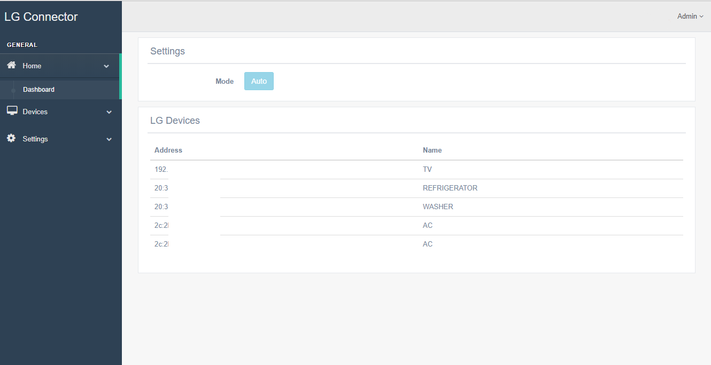
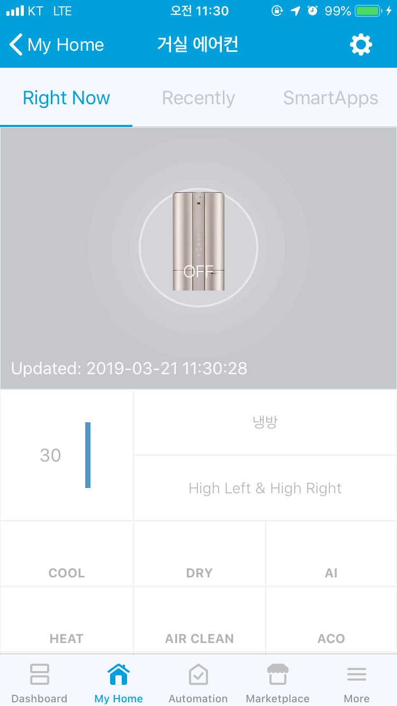
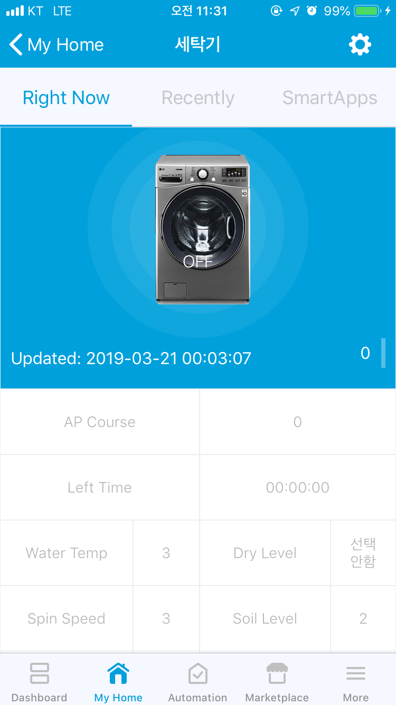
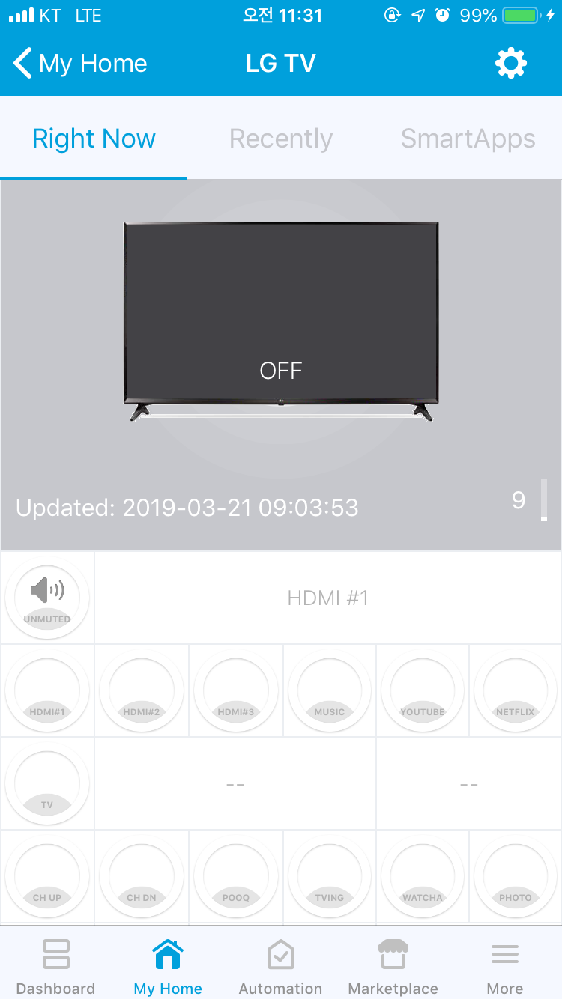
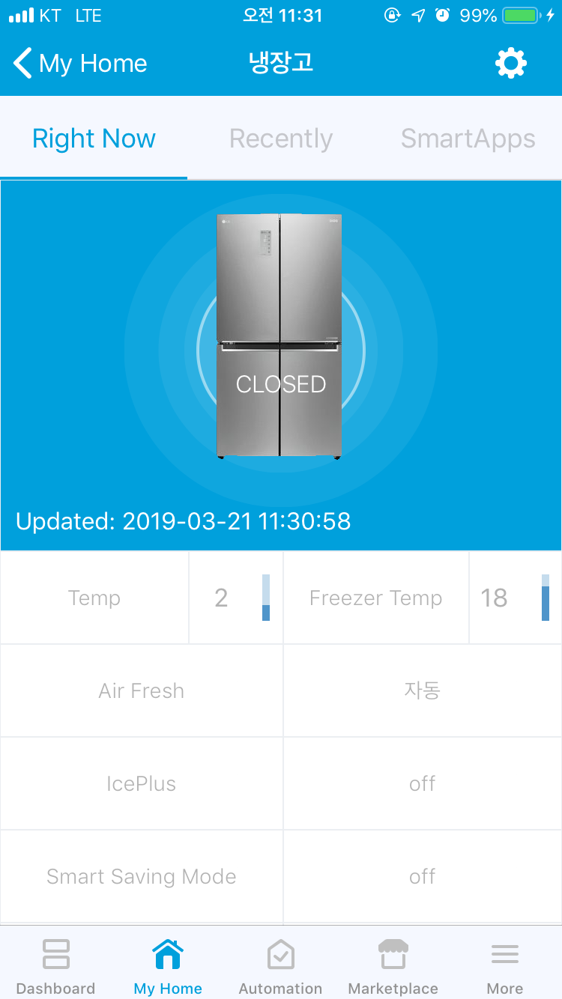

# LG Connector
Connector for LG devices with [SmartThings](https://www.smartthings.com/getting-started)

Simplifies the setup of LG devices with SmartThings.<br/>
If LG Connector is installed, virtual devices are registered automatically by the LG Connector SmartApp.<br/>
You don't have to do anything to add LG devices in SmartThings IDE.

Please see the [prerequisites](#prerequisites) needed for this connector to work properly.

## Donation
If this project helps you, you can give me a cup of coffee<br/>
[](https://paypal.me/fison67)
<br/><br/>

# Table of contents

<!-- TOC depthFrom:1 depthTo:6 withLinks:1 updateOnSave:0 orderedList:0 -->

- [Release Notes](#release-notes)
- [Documentation](#documentation)
	- [Management Web Desktop Version](#management-web-desktop-version)
	- [Management Web Mobile Version](#management-web-mobile-version)
	- [DTH Example](#dth-example)
	- [Supported devices](#supported-devices)
- [Installation](#installation)
	- [Prerequisites](#prerequisites)
	- [Docker Versions](#docker-versions)
		- [Stable Versions](#stable-versions)
	- [Install LG Connector API Server](#install-lg-connector-api-server)
		- [Raspberry Pi](#raspberry-pi)
		- [Synology NAS](#synology-nas)
		- [Linux x86 x64](#linux-x86-x64)
	- [LG Connector configuration](#lg-connector-configuration)
	- [Install Device Type Handler (DTH)](#install-device-type-handler-dth)
		- [Manual install](#manual-install)
		- [Install DTH using the GitHub Repo integration](#install-dth-using-the-github-repo-integration)
	- [Install SmartApp](#install-smartapp)
		- [Install SmartApp using the GitHub Repo integration](#install-smartapp-using-the-github-repo-integration)
- [Library](#library)
- [License](#license)

<!-- /TOC -->


# Release Notes

### Version: 0.0.2
```
Added support devices.
```


# Documentation
<br/><br/>

## Management Web Desktop Version

<br/><br/>

## Management Web Mobile Version

<br/><br/>

## DTH Example




<br/><br/>

## Supported Devices
LG TV<br/>
LG Air Conditioner<br/>
LG Washer<br/>
LG Refrigerator<br/>
<br/><br/>


# Installation

## Prerequisites
* SmartThings account
* Local server (Synology NAS, Raspberry Pi, Linux Server) with Docker installed


## Docker Versions

### Stable Versions
| Docker tag |
| ------------- |
|fison67/lg-connector:0.0.2|
|fison67/lg-connector-rasp:0.0.2|
<br/><br/>


## Install LG Connector API Server
### Raspberry Pi
> Docker must be installed and running before continuing the installation.

```
sudo mkdir /docker
sudo mkdir /docker/lg-connector
sudo chown -R pi:pi /docker
docker pull fison67/lg-connector-rasp:0.0.2
docker run -d --restart=always -v /docker/lg-connector:/config --name=lg-connector-rasp --net=host fison67/lg-connector-rasp:0.0.2
```

### Synology NAS
> Docker must be installed and running before continuing the installation. <br/>

See the [manual](doc/install/synology/README.md) for details

```
1. Open Docker app in Synology Web GUI
2. Select the Registry tab in the left menu
3. Search for "fison67"
4. Select and download the "fison67/lg-connector" image (choose the "latest" tag for the stable version or see the Docker Versions section above for other versions/tags)
5. Select the Image tab in the left menu and wait for the image to fully download
6. Select the downloaded image and click on the Launch button
7. Give the Container a sensible name (e.g. "lg-connector")
8. Click on Advanced Settings
9. Check the "auto-restart" checkbox in the Advanced Settings tab
10. Click on Add Folder in the Volume tab and create a new folder (e.g. /docker/lg-connector) for the configuration files. Fill in "/config" in the Mount path field.
11.  Check the "Use the same network as Docker Host" checkbox in the Network tab
12. Click on Apply => Next => Apply
```

### Linux x86 x64
> Docker must be installed and running before continuing the installation.

```
sudo mkdir /docker
sudo mkdir /docker/lg-connector
docker pull fison67/lg-connector:0.0.2
docker run -d --restart=always -v /docker/lg-connector:/config --name=lg-connector --net=host fison67/lg-connector:0.0.2
```
<br/><br/>


## LG Connector configuration

```
1. Open LG Connector web settings page (http://X.X.X.X:30020/settings)
2. Default Login ID & Password is [ admin / 12345 ]
3. Select a System IP Address. & Press a Save button.
4. Open a LG Connector of Smartapp. Fill in the blanks. Press Save button.
5. Go to the Smartthinq tab of web setting page & Press a Get Token button. 
   You can see a new window.
   Login by your lg account. When you success a login, Copy an url of brower and paste it to box of Refresh Token.
5. Restart LG Connector Docker container
```


## Install Device Type Handler (DTH)

### Manual install
```
Go to the SmartThings IDE
Click My Device Handlers
Click Create New Device Handlers
Copy content of file in the devicetypes/fison67 folder to the area
Click Create
Loop until all of file is registered
```

### Install DTH using the GitHub Repo integration
> Enable the GitHub integration before continuing the installation. Perform step 1 and 2 in the [SmartThings guide](https://docs.smartthings.com/en/latest/tools-and-ide/github-integration.html#step-1-enable-github-integration) to enable the GitHub integration for your SmartThings account.

```
1. Go to the SmartThings IDE
2. Select the My Device Handlers tab
3. Click on the "Settings" button
4. Click on the "Add new repository" option and fill in the following information:
    Owner: fison67
    Name: LG-Connector
    Branch: master
5. Click on the "Save" button
6. Click on the "Update from Repo" button and select the "LG-Connector (master)" option
7. Check the checkbox for the device types you need (or all of them) in the "New (only in GitHub)" column
8. Check the "Publish" checkbox and click on the "Execute Update" button
```

## Install SmartApp
See the [Manual](doc/install/smartapp/README.md) file for details
```
Connect to the SmartThings IDE
Click My SmartApps
Click New SmartApp
Click From Code
Copy content of lg_connector.groovy & Paste
Click Create
Click My SmartApps & Edit properties (LG Connector)
Enable OAuth
Update Click
```

### Install SmartApp using the GitHub Repo integration
> Enable the GitHub integration before continuing the installation. Perform step 1 and 2 in the [SmartThings guide](https://docs.smartthings.com/en/latest/tools-and-ide/github-integration.html#step-1-enable-github-integration) to enable the GitHub integration for your SmartThings account.

```
1. Go to the SmartThings IDE
2. Select the My SmartApps tab
3. Click on the Settings button
4. Click on the "Add new repository" option and fill in the following information:
    Owner: fison67
    Name: LG-Connector
    Branch: master
5. Click on the "Save" button
6. Click on the "Update from Repo" button and select the "LG-Connector (master)" option
7. Check the checkbox for the device types you need (or all of them) in the "New (only in GitHub)" column
8. Check the "Publish" checkbox and click on the "Execute Update" button
9. Select the My SmartApps tab
10. Click on the "Edit Properties" button for the LG Connector SmartApp (fison67 : LG Connector)
11. Click on the "OAuth" option and click on the "Enable OAuth" button
12. Click on the "Update" button
```
Step 3 and 4 are only needed if the repo has not been added earlier (e.g. in the DTH installation).
<br/><br/>


# License

This project is licensed under the MIT License - see the [LICENSE](LICENSE) file for details
